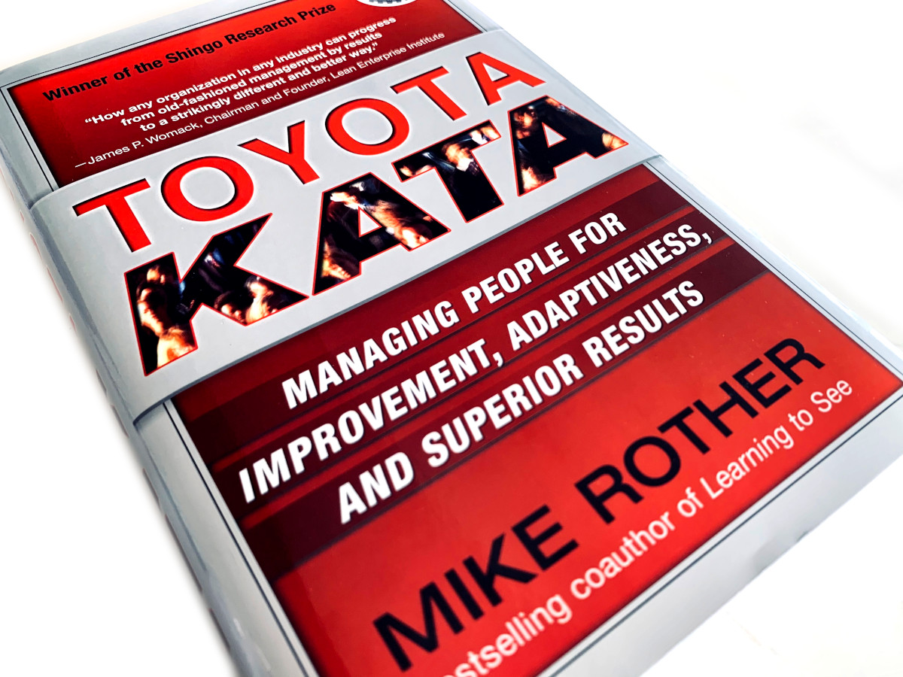

# Welcome to Bookware

Welcome to everyone interested in the art of growing software products. Bookware is a group that gets together to present and discuss influential books, papers and blogs that have helped us in the many unique or ubiquitous challenges of our industry.

We meet online to hear about a good read, or share one with others.

Our meet ups last about half an hour, with the following format:
* 5 minutes welcome and introduction
* 15 minutes presentation of the book
* 10 minutes for Q&A
* 10 minutes to wrap up, extended questions or discuss options for the next meet up.

# What is Bookware

All IT products rely on *software*, and *hardware* to run it on. What can sometimes be forgotten is the knowledge you need to create that software, and the vast body of knowledge that's already out there to help.

This is *Bookware*; the problems solved, the lessons learned, the patterns, the antipatterns, developed over decades and layed out for us to learn from.

# How to get involved

Join us on Slack with this [invitation link](https://join.slack.com/t/bookware/shared_invite/zt-oeq6s8ud-~zbNxfnEUK~cQMheVPdG8g). This is where we will advertise our upcoming meet ups and how to join them.

## Next up

Tuesday 4th May @ 20:00 BST: **Toyota Kata** by Mike Rother.

